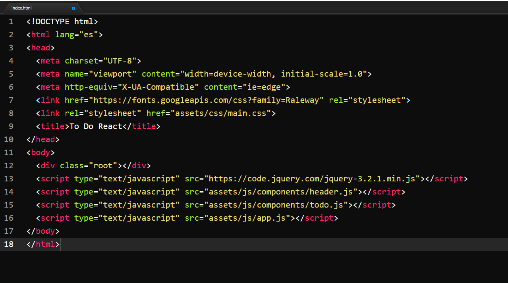
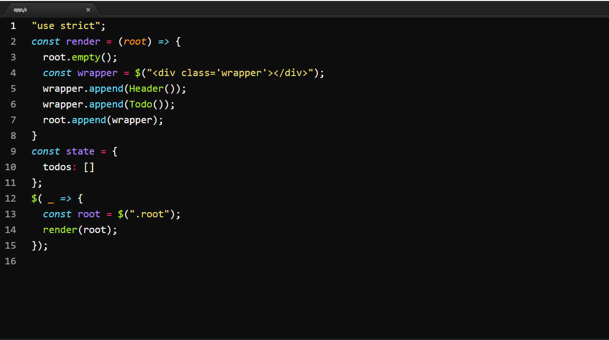
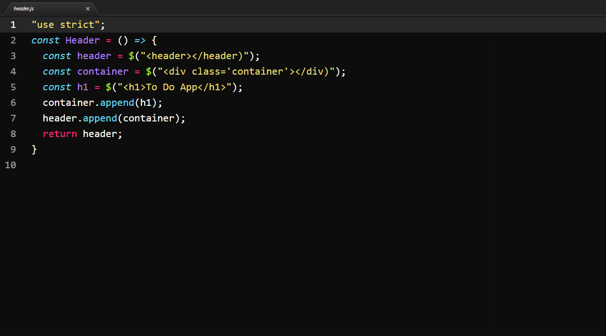
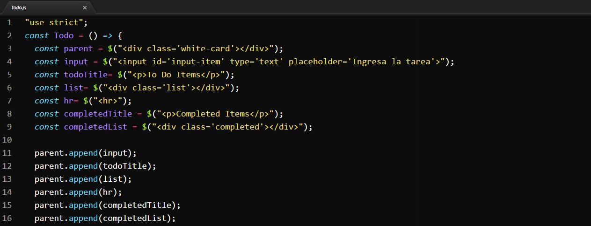
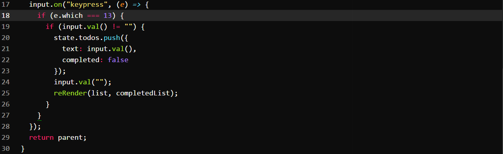

<h1>Ejercicio Guiado: To Do App</h1>
<h4>Aplicación basada en la herramienta de organización "To Do List"</h4>

El presente proyecto es una página web cuyo funcionamiento ayuda organizar las <strong>"Tareas pendientes"</strong> y 
   registrar las <strong>"Tareas realizadas"</strong> para ello se basa en la estructura de la herramienta de organización To Do List.
 

 <h3>Recursos</h3>
 <ul>
  <li>HTML 5</li>
  <li>CSS 3</li>
  <li>ECMASCRIPT 6</li>
  <li>JQUERY</li>
 </ul>
 <h3>Funcionamiento</h3>
 
 <h3>Desarrollo</h3>
 1. Estructura Inicial de Index.html
 
Se enlazan los archivos de css, javascript y se inscrusta el CDN de jQuery.Se crea un div que almacenará los elementos que se           crearán por javascript usando la librería de jQuery.

 
 2. Implementación del componente Render
 
En el archivo app.js se implementa el componente Render, el cual sera el contenedor de los componentes "Header" y "Todo". Se emplea      la sentencia "use strict" para poder utilizar la sintaxis Ecmascript 6.

 
3. Implementación del componente Header
 
En el archivo header.js se implementa el componente Header, el cual tendrá la estructura necesaria para el título de la App.

 <
 4. Implementación del componente Todo
 
En el archivo todo.js se implementa el componente Todo, el cual tendrá la estructura necesaria para la sección principal donde se       realizará el registro de las "Tareas pendientes" . 
    En la siguiente imagen se muestra la creación de los elementos.
 

 <
 
El evento asociado al input "Ingresa la tarea", se disparará cuando el usuario de presione la tecla "enter", obteniendo la tarea         ingresada y la organizará en la lista de "To Do". 
    Luego limpiará el input para que una nueva tarea sea registrada.
 

 <

