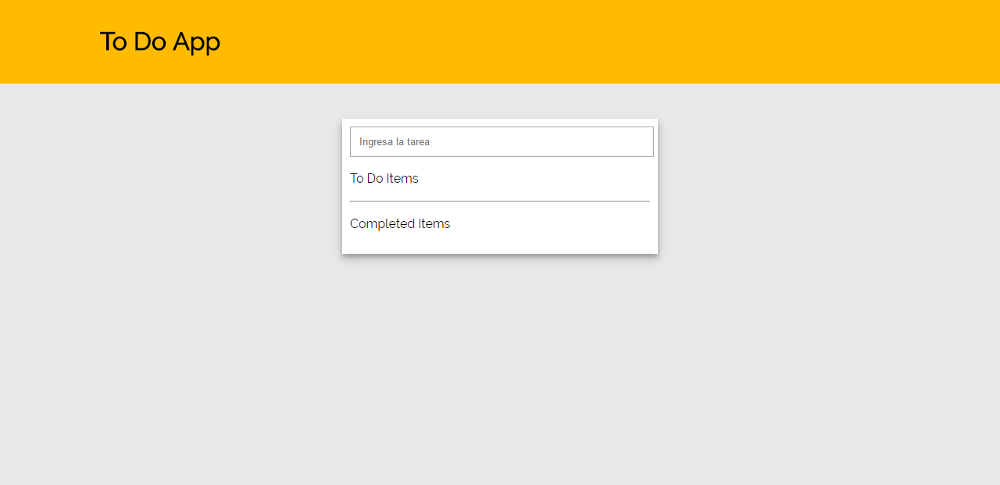
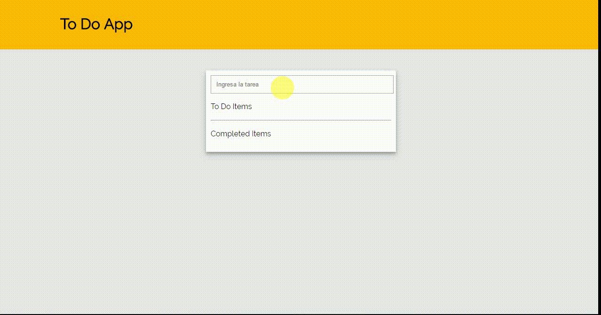

<h1>Ejercicio Guiado: To Do App</h1>
<h4>Aplicación basada en la herramienta de organización "To Do List"</h4>

El presente proyecto es una página web cuyo funcionamiento ayuda organizar las <strong>"Tareas pendientes"</strong> y 
   registrar las <strong>"Tareas realizadas"</strong> para ello se basa en la estructura de la herramienta de organización To Do List.
 

 <h3>Recursos</h3>
 <ul>
  <li>HTML 5</li>
  <li>CSS 3</li>
  <li>ECMASCRIPT 6</li>
  <li>JQUERY</li>
 </ul>
 <h3>Funcionamiento</h3>
 
 <h3>Desarrollo</h3>
 1. Estructura Inicial de Index.html
 
Aquí va la descripción

 
 2. Estructura Inicial de Index.html
 
Aquí va la descripción

 
3. Estructura Inicial de Index.html
 
Aquí va la descripción

 

